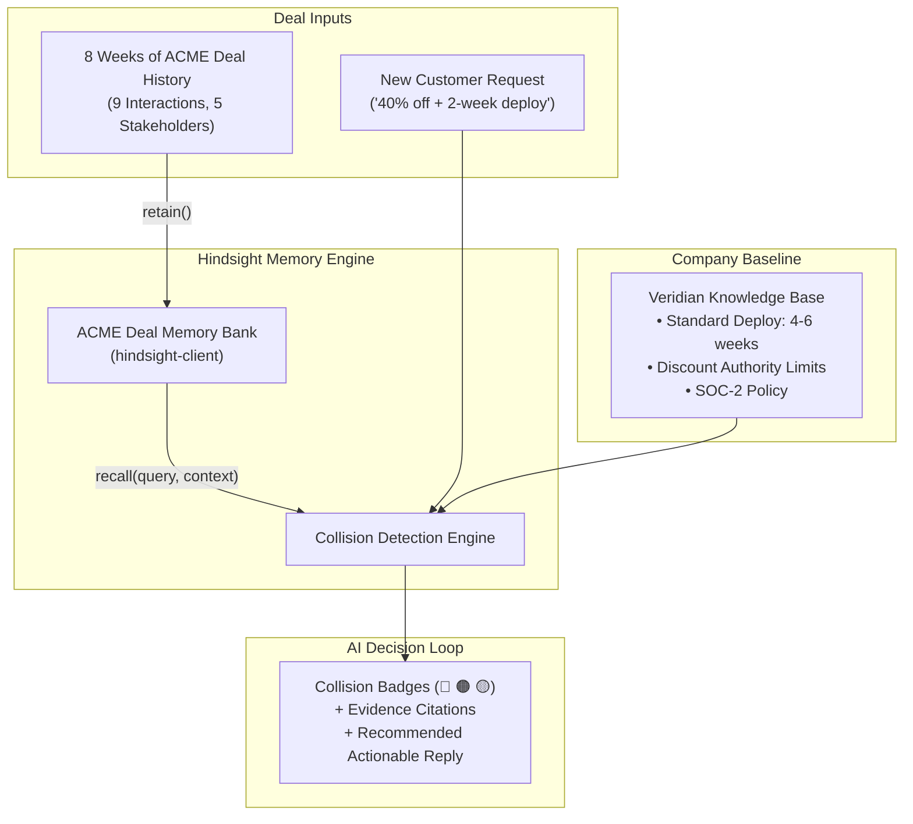

# Foresight: Hindsight-Powered Deal Intelligence for Enterprise Sales

> **Tagline:** *Foresight: Powered by Hindsight.*  
> *"Hindsight gives you foresight."*

---

## 🎯 Executive Summary

In enterprise B2B sales, deals span months across multiple stakeholders (Champions, CFOs, Security, Procurement). Sales reps routinely forget commitments made weeks ago, leading to blown margins, unrealistic timeline promises, or stalled security reviews.

**Foresight** is an AI deal intelligence assistant. Instead of acting as a generic text-generating chatbot, Foresight maintains a **living Hindsight memory bank** of the entire deal history. When a customer sends a new request, Foresight runs an automated **Collision Check** against deal memory and company baseline constraints, surfacing conflicting evidence and actionable recommendations.

---

## ⚡ The Core Capabilities

### 1. Instant Pre-Call Briefing & Winning Tactics (Zero Time Re-Reading CRM Notes)
> *"Sales reps waste hours re-reading CRM notes before calls. An agent with deal memory can brief a rep in seconds and suggest winning tactics based on past deals."* — *Hackathon Problem Statement*

With a single click (`[ Generate Pre-Call Brief ]`), Foresight digests weeks of interactions and instantly outputs:
* **Stakeholder Dossier & Sensitivities:** Who is in today's call and their core priorities (Priya's internal championing, Linda's strict \$50k ceiling, Nadia's non-negotiable security review).
* **Competitor Intelligence:** Remembers NimbusAI's entry at \$48k and surfaces our key technical differentiators.
* **Learned Winning Tactics:** Suggests battle-tested objection-handling tactics derived from historical closed-won deals.

### 2. The Collision Check (Main Safeguard)
When a customer sends a high-pressure request:  
> *"Can you give us 40% off and get us into production in two weeks?"*

Foresight checks the request against Hindsight memory and instantly detects collisions:
* 🔴 **Security Blocker:** Security Lead (Nadia) stated: *"No production data until SOC-2 report is reviewed."* Sales rep promised the report 31 days ago, but memory records **No fulfilment recorded**.
* 🟠 **Timeline Conflict:** Lead Engineer (Marcus) verified our deployment takes 4–6 weeks. No two-week commitment was ever made.
* 🟡 **Commercial Alignment:** Current quote is \$72k. 40% off is \$43.2k. Customer budget is \$50k; Competitor NimbusAI is at \$48k. Sales rep has no authority for a 40% discount without VP approval.

### 3. The Living Commitment Ledger
Maintains an auditable, status-tracked ledger of all promises made during the deal:
| Commitment | Promised By | Recipient | Status | Evidence |
| :--- | :--- | :--- | :--- | :--- |
| Architecture Deep Dive | Veridian | Marcus (Tech) | ✅ Completed | Call #3 |
| SOC-2 Type II Report | Veridian | Nadia (Security) | ⚠️ Overdue (31d) | Call #2 (No fulfilment recorded) |
| Pen-Test Executive Summary | Veridian | Nadia (Security) | ⏳ Pending Review | Call #5 |

### 4. Dynamic Memory Reaction (The Winning Demo Moment)
When the user clicks **"Mark SOC-2 Report as Sent"**:
1. Hindsight immediately updates the deal memory bank.
2. The Collision Check is re-evaluated.
3. The 🔴 Security Blocker dissolves into a ✅ Verified Step.
4. The AI recommendation dynamically pivots from *"Stop: Do not discuss deployment dates until SOC-2 is delivered"* to *"Proceed with commercial negotiation at \$48k–\$50k on a 4-week timeline."*

### 5. Predictive Foresight: Question Bombardment & Anticipation Engine
When a sales rep or customer bombards the assistant with rapid-fire questions, demands, or an aggressive RFP email:
* 🔮 **Anticipated Next Questions:** Based on deal memory, current stage, and unresolved stakeholder requirements, Foresight predicts what the customer will ask *next* before they even ask it:
  * *Example:* *"Because Linda (CFO) is bound by an Oct 31 budget deadline, Owen (Procurement) will almost certainly ask: 'What are your payment terms (Net 30 vs Net 60)?' and 'Can you cap annual renewal price increases at 3%?'"*
* 💡 **Similar Inquiries & Strategic Counter-Questions:**
  * **Similar Historical Inquiries:** Clusters the incoming questions and matches them against similar queries raised in past comparable enterprise deals.
  * **Offensive Counter-Questions:** Suggests high-leverage questions the sales rep should ask the champion to regain control:
    * *Example:* *"If we match \$48k, can Linda guarantee contract sign-off before your October 15 production freeze?"*

---

## 🏗️ Architecture

---

## 👥 The ACME vs. Veridian Benchmark Case

* **Client:** ACME Corp (5 Stakeholders: Priya - Champion, Marcus - Tech Evaluator, Linda - CFO, Nadia - Security Gatekeeper, Owen - Procurement).
* **Vendor:** Veridian (Our Company).
* **Timeline:** 8 weeks, 9 key interactions (Discovery, Security Call, Architecture Demo, CFO Budget Alignment, Competitor NimbusAI entry).

---

## 👥 Team & Component Ownership
* **Member 1:** Ingestion Pipeline & Instant Pre-Call Briefing (`memory.py`)
* **Member 2 (Tanmaya):** Collision Check Engine & Dynamic Memory Reflection (`tanmaya/`)
* **Member 3:** Predictive Foresight & Living Commitment Ledger (`collision_engine.py`)

---
*Created for CtrlAltDeploy.*

